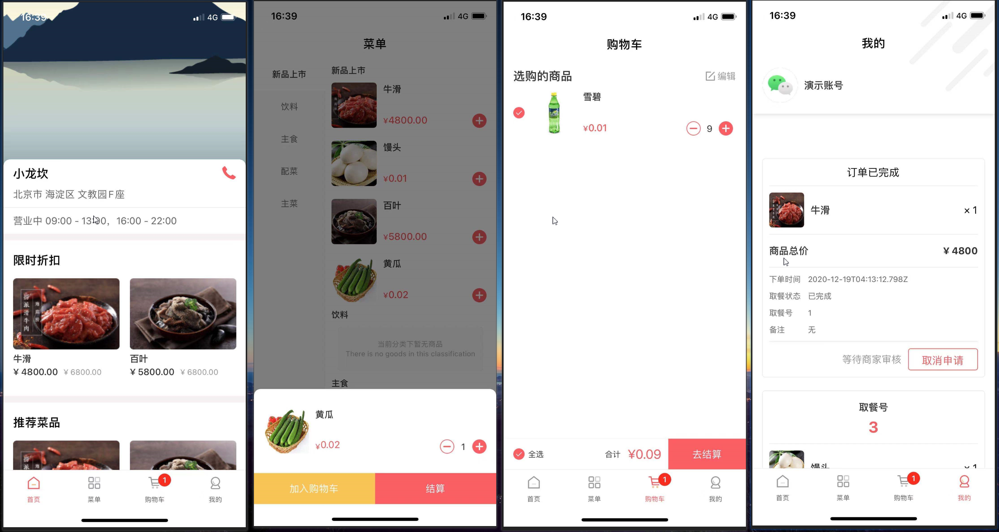
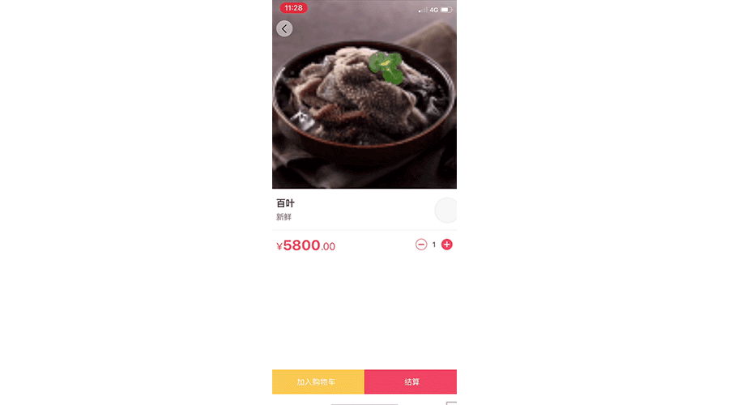
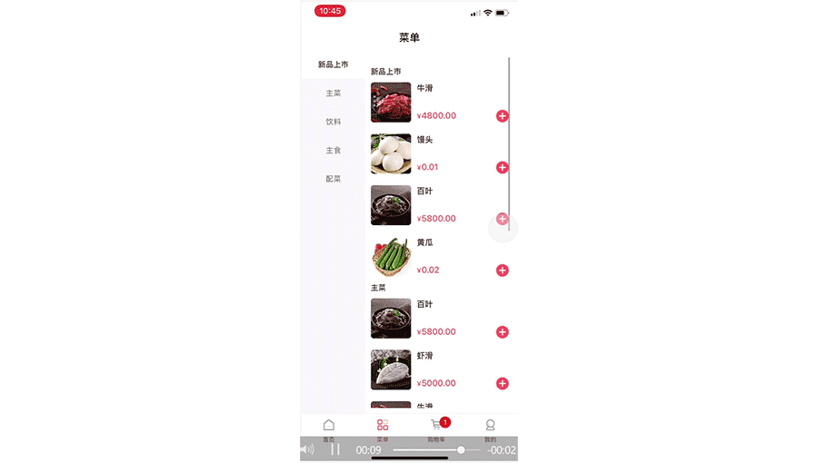
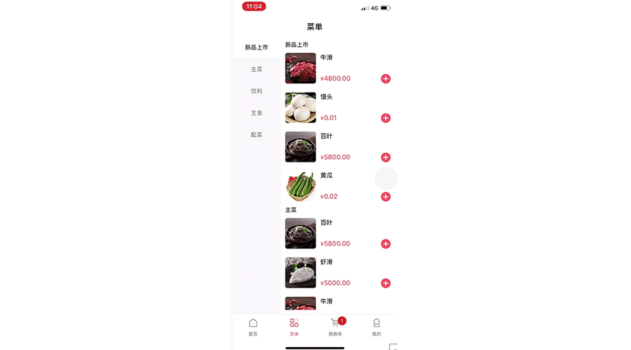
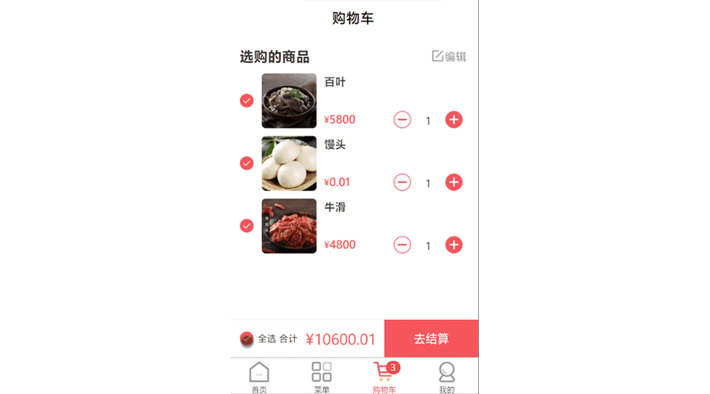
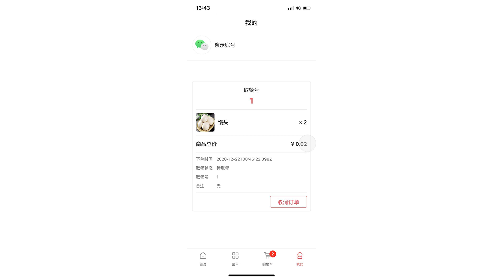
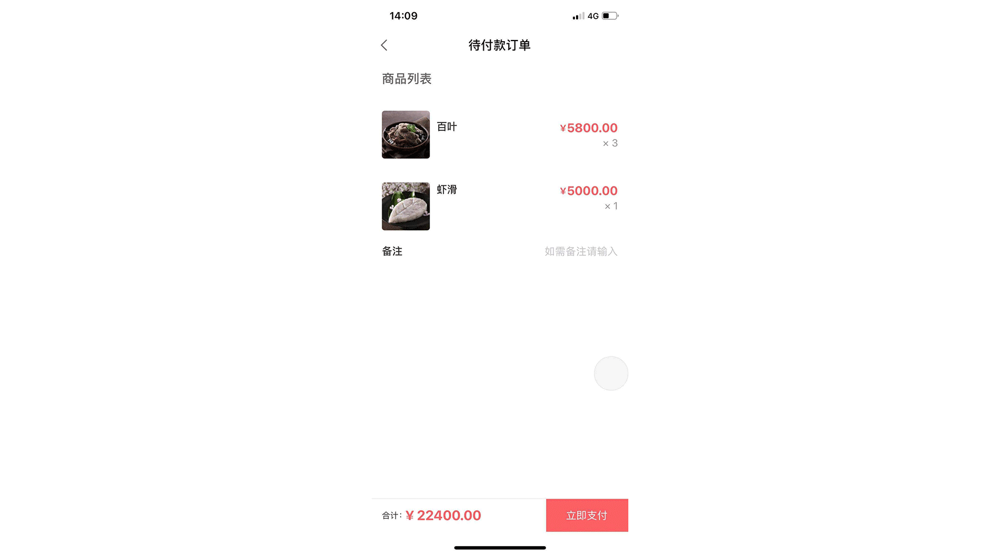
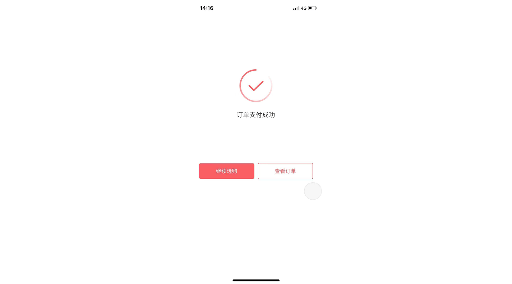

本文地址: (如果遇到图片显示异常，尝试使用 ` gitee ` 镜像)

` github ` https://github.com/apicloudcom/ordering-food/tree/main/docs

` gitee `  https://gitee.com/YangYongAn/ordering-food/tree/main/docs

# 堂食点餐源码解析文档

> 《点餐》项目是一个餐饮商户单商家堂食下单应用。
> 主要功能包括浏览商家主页信息、查看推荐菜品、下单商品、取餐等号等功能。
> 可以适用于小吃快餐餐饮商户的堂食点单管理，也可以进行稍微二开成为外卖、店铺或者是虚拟服务等电商小应用。

## 项目架构

项目中前端技术要点包括跨页面通信、全局购物车数据管理、自定义复用组件编写和辅助助手函数等等。 使用  ` APICloud `  多端技术实现了一套代码，多端运行。 支持编译成 ` Android `  &  ` iOS `   ` App `
以及微信小程序。

项目后端使用的是 ` APICloud ` [数据云3.0](https://docs.apicloud.com/Cloud-API/sentosa) 来构建的：
通过编写云函数自动管理维护接口和数据，详细可以参考数据云的文档。也可以自定义后端接口，通过自写服务器完成开发。

### 使用步骤

项目的初始化、预览、调试和打包等操作请参考 [APICloud多端开发快速上手教程](https://github.com/apicloudcom/hello-app/blob/main/README.md) 。
**本文侧重于《点餐》项目的技术要点分析和说明**。

项目源码位于 https://github.com/apicloudcom/ordering-food 。具体的项目源码是在仓库代码的 ` widget ` 目录下面，此目录也就是应用的根目录。

### 源码文件目录结构

项目源码在本仓库的  ` widget ` 目录下。其中该目录下的文件结构如下：

~~~
┌─component/                项目公共组件目录
│  ├─empty-block.shtml      空数据占位图组件
│  ├─goods-action.shtml     商品下单动作组件
│  ├─goods-counter.shtml    商品加购计数器组件
│  ├─goods-list-item.shtml  主页商品列表单品组件
│  ├─order-item.shtml       订单列表单品组件
│  ├─radio-box.shtml        自定义选择器组件
├─css/                      css样式目录
├─image/                    图片素材图标资源目录
├─pages/                    新版的AVM页面目录
│  ├─goods_add
│  │  └─goods_add.stml      加购浮层
│  ├─goods_detail
│  │  └─goods_detail.stml   商品详情页
│  ├─main_cart
│  │  └─main_cart.stml      主tab-2 购物车页面
│  ├─main_home
│  │  └─main_home.stml      主tab-0 商家主页
│  ├─main_menu
│  │  └─main_menu.stml      主tab-1 点餐菜单页面
│  ├─main_user
│  │  └─main_user.stml      主tab-3 用户主页
│  ├─pay_result
│  │  └─pay_result.stml     支付结果页
│  ├─pending_order
│  │  └─pending_order.stml  待付款结算页
├─script/                   JavaScript脚本目录
└─config.xml                应用配置文件
~~~

## 首页 TabBar 结构的处理

### 为什么需要一个 ` app.json ` 配置文件

《点餐》项目的首页是由一个可以同级切换窗口组构成的。 在 ` APP ` 原生端 上面， 我们可以借助 ` FrameGroup ` 来实现这样的切换组。 小程序原生上则是使用 ` app.json `
配置文件来 [配置定义 ` TabBar ` 的相关属性](https://developers.weixin.qq.com/miniprogram/dev/framework/ability/custom-tabbar.html) 。
为了统一两端的差异问题，通过在 ` weight ` 根目录下定义一个 ` app.json `
文件，具体字段说明请参考[《openTabLayout布局文档》](https://docs.apicloud.com/Client-API/api#openTabLayout) 。 所以，如果只书写原生端 ` APP `
，而不计划支持小程序的话，这个配置文件就是可选的了。

### TabBar页面的组织

在这个配置文件中，可以声明底部栏的标签文案、对应图标的选中和未选中状态以及对应需要跳转的页面路径。 所以需要准备四个主页面。 在 ` pages `目录准备建立这四个页面。 分别是 “商家主页”  ` main_home ` 、
“菜单页面” ` main_menu ` 、 “购物车页面” ` main_cart ` 和 “用户主页” ` main_user ` 。 为了兼容小程序目录结构，需要使用同名文件夹对其包裹一层。

### 商家主页 ` main_home ` 的编写

先看到主页效果图，然后大致分析一下页面结构。源代码在 ` /widget/pages/main_home/main_home.stml ` 。 页面主要部分是一个滚动效果，需要使用一个 ` scroll-view ` 来做滚动部分的容器。
头部有一个固定头部，并跟随上面提到的 ` scroll-view ` 的滚动高度来做透明度反馈。

布局结构使用系统推荐的 ` flex ` 布局。有一点需要注意的是， ` flex ` 布局的 ` flex-direction ` 默认是  ` column ` ，
也就是竖着排列的方向，这一点是和传统网页中不一定地方。另外，每一个组件默认会附带 ` display:flex; `属性。

#### 请求接口数据 （数据处理和请求库封装）

在页面的生命周期 ` apiready ` 中，有一个 ` this.getData() `的方法，就是在请求数据。

~~~js
function getData() {
    GET('shops/getInfo')
        .then(data => {
            this.data.shopInfo = data;
        })
}
~~~

这个函数主要使用一个  ` GET ` 方法实现的。这个方法来自于：

~~~js
import {GET} from "../../script/req";
~~~

这个文件中，主要处理了应用的请求、会话和异常处理等逻辑。
相关业务代码可以只是作为参考，具体项目中根据实际的会话认证方式、服务接口模式以及个人偏好等方式去组织。

拿到数据以后，通过 ` this.data.shopInfo = data ` 将数据交给到页面的数据域中，以便于接下来的数据绑定显示。

#### 商家头图和主要信息 （数据绑定）

头部主图是不会和 ` scroll-view ` 一起滚动的，所以它应该在滚动容器的外部。使用一个 ` img ` 图片标签来显示图片。 其数据是来自服务器接口的数据，
使用 ` avm.js ` 提供的[《数据绑定》](https://docs.apicloud.com/apicloud3/#/basic/databind?index=1&subIndex=2) 来处理数据。

~~~html

~~~

商家的营业信息也同上，按照接口数据绑定出相应字段，即可显示出来。

~~~html

<view class="shop"
      style={{'margin-top:'+photoRealHeight+'px'}}>
    <view class="shop-header flex-h">
        <text class="shop-name flex-1 ellipsis-1">{{ shopInfo.name }}</text>
        
    </view>
    <view class="content-wrap">
        <text class="shop-text shop-address">
            {{ shopInfo.city }} {{ shopInfo.country }} {{ shopInfo.address }}
        </text>
    </view>
    <view class="shop-operation content-wrap">
        <text class="shop-text">营业中 09:00 - 13:00，16:00 - 22:00</text>
    </view>
</view>

~~~

#### 拨打电话的动作 （事件绑定）

其中电话的图标点击以后，需要实现拨打电话的效果。为其绑定一个点击事件，叫做 ` callPhone ` ，并在 ` methods ` 去实现：

~~~js
function callPhone() {
    if (isMP()) {
        wx.makePhoneCall({
            phoneNumber: this.data.shopInfo.phone
        })
    } else {
        api.call({
            type: 'tel_prompt',
            number: this.data.shopInfo.phone
        });
    }
}
~~~

#### 推荐菜品和栏目 （v-for循环和组件）

仔细观察这里的模板和数据，实际上可以分解为 ` 一个主标题 ` 加上 ` 一组菜品 ` 这样的结构来循环。 其中 ` 一组菜品 ` 再使用循环，渲染出单品。

使用循环来展示三个分组数据。

~~~html

<view class="list" v-for="item in classifyList">
    <goods-list-item class="goods-item" :list="item.togc" :title="item.name"></goods-list-item>
</view>

~~~

每一个循环中包含一个 ` <goods-list-item /> ` 组件。这个组件来自于自定义组件：

~~~js
import goodsListItem from '../../components/goods-list-item.stml';
~~~

在自定义组件中，完成组件内部的组件样式、数据管理和事件响应等，符合组件化开发思想和提高项目的开发效率和维护性。 在这个组件中，同样的使用了循环来处理每个栏目的单品数据。 每个单品绑定了一个 ` intoGoodsDetail `
事件来实现跳转到商品详情页。

~~~js
function intoGoodsDetail(item) {
    api.openWin({
        name: 'goods_detail',
        url: '../../pages/goods_detail/goods_detail.stml',
        pageParam: {
            item
        }
    })
}
~~~

#### 页面头部header

~~~html

<view class="header-bar"
      style={{'opacity:'+this.data.opacity+';padding-top:'+safeAreaTop+'px'}}>
    <text class="nav-title shop-name">{{ shopInfo.name }}</text>
</view>

~~~

头部是一个普通的 ` view ` +  ` text ` 的结构。为了实现滚动处理透明度，为其绑定一个动态的 ` style ` 属性。 动态改变其透明度 ` opacity ` 。

而这个 ` opacity ` 的取值依赖于 ` scroll-view ` 的滚动高度。
` scroll-view ` 的滚动会触发相关数据的变动，所以为其绑定上一个滚动事件 `  @scroll="onScroll" ` 和相关处理逻辑 ` onScroll ` 。

~~~js
function onScroll(e) {
    const y = isMP() ? e.detail.scrollTop : e.detail.y;

    let threshold = this.photoRealHeight - y;
    if (threshold < 0) {
        threshold = 0;
    }
    this.data.opacity = 1 - threshold / this.photoRealHeight;
    api.setStatusBarStyle && api.setStatusBarStyle({
        style: this.statusBarStyle
    });
}
~~~

在 ` onScroll ` 中能够拿到相应的滚动高度，并且计算出透明度的最终结果。 同时发现透明度的更改也会伴随着顶部状态栏文本的颜色变化。使用端能力 ` api.setStatusBarStyle ` 来进行相应设置。

如此一来，商家主页的相关逻辑的数据处理的差不多了，同时介绍了基础的事件和数据处理等。

### 商品详情页 (组件通信、全局数据和事件)

页面加载的时候，通过页面传参拿到商品详情数据。另外一个商品的加购数量是存在名为 ` CART-DATA `的全局数据中，在页面生命周期函数 ` apiready `中拿到相关数据：

~~~js
this.data.goods = api.pageParam.item.togoods;  // 拿到商品主数据

let cartList = api.getPrefs({sync: true, key: 'CART-DATA'}); // 获取加购数量
if (cartList) {
    cartList = JSON.parse(cartList)
    this.data.cartData = cartList[this.data.goods.id];
    if (this.data.cartData) {
        this.data.count = this.data.cartData.count;
    }
}
~~~

#### 计数器组件 ` goods_counter `

商品详情页使用了两个自定义组件，一个是 ` goods_counter `，是一个商品计数器。 以后其他页面可能也会使用到，所以将其封装起来。

~~~html

<goods-counter onCountChange={this.countChange.bind(this)} :count="count"></goods-counter>

~~~

使用一个动态属性  ` :count="count" ` 将刚刚获取到的当前商品的加购数量传入。 在 ` goods_counter ` 内部，点击加减按钮触发 ` countChange ` 事件。在事件中向父页面传递：

~~~js
function countChange(change) {
    if (this.props.count + change === 0) {
        return api.toast({
            msg: '不能再减少了\n可在购物车编辑模式下移除',
            location: 'middle'
        })
    }
    this.fire('CountChange', {
        change,
        props: this.props
    })
}
~~~

所以在组件调用的时候，绑定一个  ` onCountChange={this.countChange.bind(this)} ` 。 这里的 ` this.countChange ` 是 ` goods_detail `
的函数，在创建组件的时候作为 ` props ` 传递到了子组件中， 在子组件中可以直接执行这个函数，或者是使用 ` fire ` 的方式“引燃”这个函数。

#### 加购动作条  ` goods_action `

商品详情页使用了两个自定义组件，另一个是 ` goods_action `，是一个商品加购动作条。 主体是两个按钮，一个加购，一个结算。

结算就是携带当前单品数据到预付款页面。逻辑很简单，就是携带数据到新页面。

加购稍微复杂一点，不过逻辑依然使用 ` fire ` 的方式上抛给一个 ` addCart `的事件到父页面，因为可能不同的页面的加购后续逻辑不太一样，具体实现就交给父级。 所以视线还是转回到 ` goods_detail `
的 ` addCart ` 的实现。

~~~js
function addCart() {
    let cartList = api.getPrefs({sync: true, key: 'CART-DATA'}) || '{}'
    cartList = JSON.parse(cartList)
    cartList[this.data.goods.id] = {
        goods: this.data.goods, count: this.data.count
    };
    api.setPrefs({
        key: 'CART-DATA',
        value: cartList
    });

    api.toast({
        msg: '成功加入' + this.data.count + '个到购物车', location: 'middle'
    })
    setTabBarBadge(2, Object.keys(cartList).length);
}
~~~

加购后考虑到相关购物车页面和底部小红点的数据。此时如果不考虑小程序的话，也可以直接发送全局广播，自行处理相关逻辑。

### 菜单点餐页面

#### 分类和菜品的双向滚动交互

这个页面是一个左右分栏的布局。左边是菜单分类，右边的菜品。 有一组比较常见的交互：

1. 滑动右侧菜品，左侧分类高亮会随其更改。
2. 点击左侧菜品分类，右侧菜品回滚到到对应区域。

其中第一个交互相关逻辑类似于在开发商家主页的滚动 ` scroll-view ` 触发头部透明度的逻辑。 所以同样地为右侧的 ` scroll-view ` 绑定上  `  @scroll="onScroll" ` 函数。

具体逻辑请参考源码的实现部分，获取滚动高度等和主页类似。

重点关注第二个交互的核心在于点击对应分类，右侧的 ` scroll-view ` 需要滚动到指定位置。 使用属性来进行位置绑定： ` scroll-top={scrollTo} `
。此时只需要在左边的分类点击事件 ` @click="switchCategory(index)" ` 计算出正确的 ` scrollTo ` 即可实现。

~~~js
function switchCategory(index) {
    this.data.categoryIndex = index;
    this.data.CD = new Date().getTime() + 500; // 手动切换分类后需要锁定500毫秒 避免右侧scroll-view滚动时带来次生问题
    this.data.scrollTo = this.offsetList[index];
}
~~~

#### 菜品和加购处理 (跨端特性处理)

右侧的菜品有一个 ` @click="openAdd(goods)" ` 事件，用于打开加购页面。

~~~js
function openAdd(goods) {
    if (isMP()) {
        this.data.currentGoods = goods;
        wx.hideTabBar();
    } else {
        api.openFrame({
            name: 'goods_add',
            url: '../goods_add/goods_add.stml',
            pageParam: {goods}
        })
    }
}
~~~

这个函数中展示了端差异上的处理。因为小程序没有类似 ` APICloud ` 的 ` frame ` 的概念， 所以新弹出的页面在小程序上，是一个页面内部组件实现的。

当然这种方式 ` APP ` 原生端也是支持的。如果需要进一步提高性能，发挥原生优势，则可以使用原生端的` frame ` 来完成。 此时，将目标页面封装在一个自定义组件中，并把当前菜品数据传递进去。

目前组件和 ` frame ` 页面的获参形式暂时不同。在 ` goods_add ` 这个组件中的 ` installed ` 生命周期中可以看到如下的兼容片段：

~~~js
this.data.goods = this.props.goods ? this.props.goods : api.pageParam.goods;
~~~

在新展开的加购浮层上，看到了之前定义的 ` goods_action `，所以大致逻辑也是获取商品数据和加购数，并实现一下addCart函数。 实际上这个页面很类似商品详情页，只是展示UI不太相同。

#### 沉浸式状态栏  ` safe-area `

在这个页面中，自己实现了一个顶部导航栏。沉浸式状态栏一般会需要获取状态栏高度等处理能力。 在 ` avm.js ` 中提供一个 ` safe-area ` 组件，用于自动处理异形屏的边界问题。

~~~html

<safe-area>
    <view class="header">
        <text class="title">菜单</text>
    </view>
</safe-area>

~~~

在主页中，也看到相关编程式获取安全区域数据的代码：

~~~js
this.data.safeAreaTop = api.safeArea ? api.safeArea.top : 0;
~~~

### 购物车页面 computed 计算和v-if的条件渲染

购物车页面是一个比较经典的展示相关页面内部逻辑的案例。

在页面初始化的时候， ` this.getCartData() ` 拿到本地存储的购物车所有的数据。

~~~js
function getCartData() {
    let cartData = api.getPrefs({sync: true, key: 'CART-DATA'});
    if (cartData) {
        cartData = JSON.parse(cartData);
        this.data.cartData = cartData;
        this.generateCartList();
        setTabBarBadge(2, Object.keys(cartData).length);
    }
}
~~~

其中还混合了一个  ` generateCartList ` 逻辑。

~~~js
function generateCartList() {
    let cartData = this.data.cartData;
    let arr = [];
    for (let i in cartData) {
        arr.push({checked: true, ...cartData[i]});
    }
    this.data.cartList = arr;
}
~~~

这是一个生成函数，是将保存的对象构建为页面所需要的数组结构，同时增加每一个元素的  ` checked ` 属性。 然后再页面部分通过 ` v-for ` 来循环当前购物车的数据。

~~~html

<view class="main-cart-goods-item" v-for="item in cartList">
    <radio-box class="main-cart-radio-box" :checked="item.checked"
               onChange={this.radioToggle.bind(this)}
               :item="item"></radio-box>
    
    <view class="main-cart-goods-info">
        <text class="main-cart-goods-name">{{ item.goods.name }}</text>
        <view class="main-cart-flex-h">
            <text class="main-cart-goods-price-signal">¥</text>
            <text class="main-cart-goods-price-num">{{ item.goods.curt_price }}</text>
            <goods-counter onCountChange={this.countChange.bind(this)}
                           :count="item.count" :item="item"></goods-counter>
        </view>
    </view>
</view>

~~~

注意到每一个条目的开头嵌套了一个 ` <radio-box/> ` 自定义组件。
这个组件担负的任务很简单，就是使用自定的样式来渲染一个单选框。当然 ` avm.js ` 自带的系统组件  [` radio `](https://docs.apicloud.com/apicloud3/#/component/radio?index=4&subIndex=12)
也是可以实现的。

#### computed 的使用

下面有一个全选按钮，用于控制是否全选。

~~~js
function checkAll() {
    const checked = !this.allChecked;
    for (let i = 0; i < this.data.cartList.length; i++) {
        this.data.cartList[i].checked = checked;
    }
}
~~~

而这个函数第一行以来的 ` this.allChecked ` 则是一个计算属性。在  ` computed ` 中能找到它的实现：

~~~js
function allChecked() {
    return !this.cartList.some((item) => { // 也可以使用 every 来修改相反逻辑实现
        return !item.checked;
    })
}
~~~

紧接着它下面还有另外一个计算属性: ` totalPrice ` :

~~~js
function totalPrice() {
    // 先筛选出选中项
    let list = this.data.cartList.filter(item => {
        return item.checked;
    })

    // 再计算总和并且格式化结果
    return (list.length ? list.reduce((total, item) => {
        return total + item.goods.curt_price * item.count;
    }, 0) : 0).toFixed(2);
}
~~~

然后再模板中直接使用这个结果，即可完成总价的显示：

~~~html

<view class="text-group">
    <text class="main-cart-footer-text">合计</text>
    <text class="main-cart-footer-price">¥{{ totalPrice }}</text>
</view>

~~~

可以看到，计算属性  ` computed `  是可以通过一些逻辑计算出需要的结果，并且会暴露给实例本身， 在模板中能够同数据一样绑定。 同时能够自动处理所依赖的数据变化，做出实时的更新。

#### v-if 条件渲染

在页面中，有一个变量标记  ` isEdit `，用来表示当前页面是否是在处于编辑状态。

~~~html

<view @click="toggleEdit">
    <text class="main-cart-finnish-text" v-if="isEdit">完成</text>
    <view v-else class="main-cart-action">
        
        <text class="main-cart-action-text">编辑</text>
    </view>
</view>

~~~

根据编辑状态的切换,右上角的按钮文案变化为“完成”和“编辑”两种状态。这个时候就可以通过 ` v-if ` 来判断渲染。 下面的结算、移除按钮也是一样，只不过是在模板中使用了三元表达式来做显示。

~~~html

<text class="main-cart-footer-btn-text">{{ isEdit ? '移除' : '去结算' }}</text>

~~~

### 用户页面

这个页面主要有两个要点：头部用户信息区域和订单列表。

#### 头部用户信息

头部的用户信息需要在初始化的时候读取本地用户数据。

~~~js
/**
 * 获取用户信息
 * @returns {boolean|any}
 */
function getUser() {
    let user = api.getPrefs({
        sync: true,
        key: 'USER'
    });
    if (user) {
        return JSON.parse(user)
    }
    return false;
}
~~~

把获取到的用户数据作为一个普通的页面数据，用来渲染用户信息面板。 如果用户数据不存在，也就是未登录模式，则需要使用 ` v-if ` 条件渲染来展示登录界面。

~~~html

<view class="user-info flex flex-h flex-center-v" v-if="userInfo" @click="logout">
    
    <text class="user-name">{{ userInfo.nickName }}</text>
</view>

<view class="user-info flex flex-h flex-center-v" v-else @click="wxLogin">
    
    <text class="user-name">使用微信登录</text>
</view>

~~~

#### 登录逻辑

在未登录的情况下，上面的第二块会展示，点击触发 ` wxLogin ` 方法：

~~~js
function wxLogin() {
    if (isMP()) {
        this.mpLogin();
    } else {
        this.doLogin({ssid: getDeviceId()});
    }
}
~~~

这里依然需要对特性平台差异化处理。因为原生端和小程序端使用微信登录是两个不同的逻辑。 源代码 ` /widget/pages/main_user/main_user.stml ` 中还展示了一些使用原生模块来调用微信来登录的逻辑。

登录成功以后，开始执行 ` loginSuccess ` ，可以保存相关用户信息和会话信息，以备以后的使用。同时还需要刷新用户的购物列表。 如果在真实项目中其他已经打开的页面也需要监测用户状态变化，可以借助广播事件来处理详细的逻辑。

~~~js
function loginSuccess(userInfo) {
    api.setPrefs({
        key: 'USER',
        value: userInfo
    });

    this.data.userInfo = userInfo;
    this.getOrderList();
}
~~~

#### 页面的下拉刷新

页面下拉刷新和触底加载依赖于  ` scroll-view ` 的相关事件绑定和实现。

~~~html

<scroll-view scroll-y class="flex-1 main-user-scroll-view"
             enable-back-to-top refresher-enabled
             refresher-triggered={{loading}}
             @refresherrefresh="onRefresh">
    <view v-if="orderList.length">
        <order-item :order="order" v-for="order in orderList"
                    onOrderAction={this.orderAction.bind(this)}></order-item>
    </view>

    <view class="empty-block" v-else>
        <empty-block text="暂无订单哦～" type="order"></empty-block>
    </view>
</scroll-view>

~~~

其中 ` @refresherrefresh="onRefresh" ` 就是在下拉刷新需要触发的逻辑。
` refresher-triggered={{loading}} ` 就是下拉刷新的状态。（用于通知回弹和设置刷新中）。

~~~js
function onRefresh() {
    this.data.loading = true; // 设置正在刷新
    if (this.data.userInfo) { //有用户信息了才刷新
        this.getOrderList();
    } else {
        setTimeout(_ => {
            this.data.loading = false;
            api.toast({
                msg: '请登录后查看历史订单'
            })
        }, 1000)
    }
}
~~~

主页的开发大致就完成了，下面关注一下付款下单的过程。

### 待付款页面 (表单数据)

该页面也比较简单，大多数实现的逻辑在前面的页面已经提及。 此外有一个输入框表单 ，用来收集用户的输入备注信息。

~~~html

<view class="order-note">
    <text class="order-note-key">备注</text>
    <input class="order-note-input" placeholder="如需备注请输入"
           onBlur="onBlur" maxlength="30" id="remark"/>
</view>

~~~

通过失去焦点事件 ` onBlur="onBlur" ` 来动态获取数据。

~~~js
function onBlur(e) {
    this.data.remark = e.target.value;
}
~~~

获取数据也还有其他多种方式，可以进一步参考组件 ` input `以及其他表单组件文档。

开始提交订单，和服务器通信下单并且支付。下单完成后做一些联动处理：

~~~js
function addOrder() {
    POST('orders/app_addorder', this.formData).then(data => {

        // 打开结果页
        api.openWin({
            name: 'pay_result',
            url: '../pay_result/pay_result.stml'
        });

        // 通知支付成功 刷新订单页面
        api.sendEvent({
            name: 'PAY-SUCCESS'
        })

        // 清空购物车
        api.setPrefs({
            key: 'CART-DATA',
            value: {}
        });

        setTabBarBadge(2, 0);

    })
}        
~~~

### 支付成功页面的跳转

下单支付后跳转到支付结果页面。（这个过程是模拟成功下单，中间可以参考微信登录过程嵌套第三方支付）

---
至此，所有的页面逻辑主线已经完成。应用中还有一些细节处理，可以参考源码和文档进一步学习研究。
